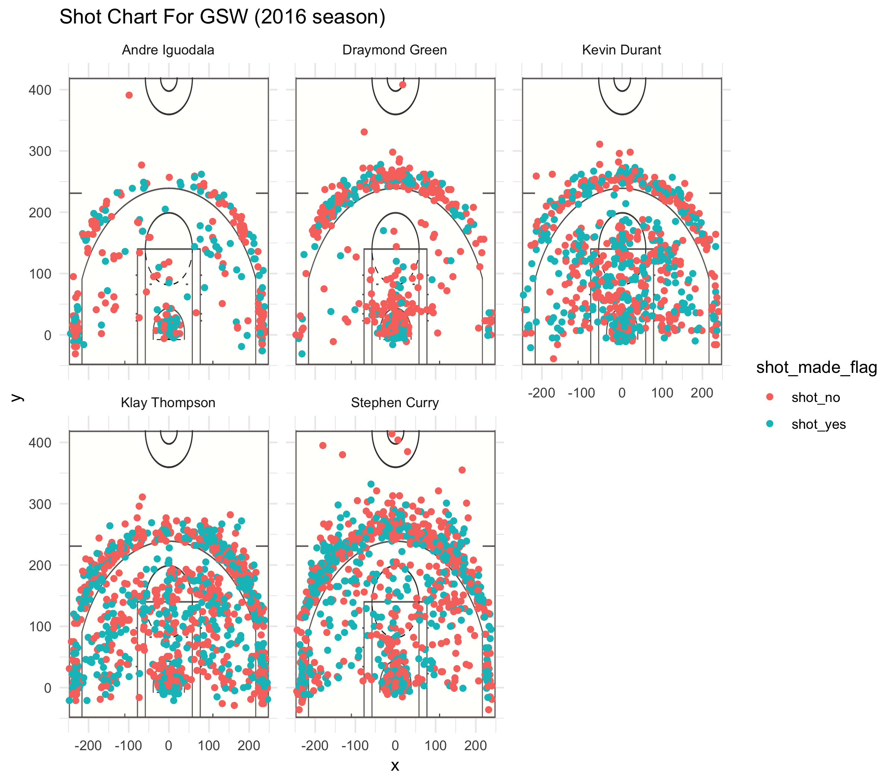

```{r}
library(ggplot2)
library(dplyr)

getwd()
```

```{r out.width = '80%', echo = FALSE, fig.align = 'center'}

```

```{r}
total <- read.csv("../data/shots-data.csv", stringsAsFactors = FALSE)
total <- data.frame(total, stringsAsFactors = FALSE)

gsw <- select(total, name, shot_made_flag, shot_type)
two_pt <- filter(gsw, shot_type == "2PT Field Goal")
three_pt <- filter(gsw, shot_type == "3PT Field Goal")

two_point<- arrange(summarise(group_by(two_pt, name), 
                              total_shots = sum(shot_type == "2PT Field Goal"),
                              made = sum(shot_made_flag == "shot_yes"),
                              perc_made = made / total_shots), desc(perc_made))

three_point <- arrange(summarise(group_by(three_pt, name), 
                                 total_shots = sum(shot_type == "3PT Field Goal"),
                                 made = sum(shot_made_flag == "shot_yes"),
                                 perc_made = made / total_shots), desc(perc_made))

overall <- arrange(summarise(group_by(gsw, name), 
                             total_shots = n(),
                             made = sum(shot_made_flag == "shot_yes"),
                             perc_made = made / total_shots), desc(perc_made))
```