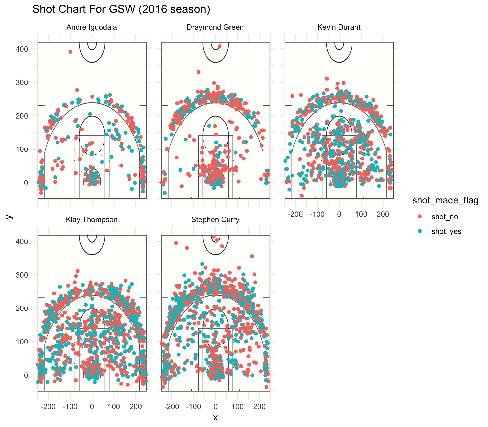

#THE SHOOTING STATISTICS OF THE FIVE GSW PLAYERS

##Iguodala, Green, Durant, Thompson, and Curry
*by Zhenzhen Fu*  

***
  

##Background
The Golden State Warriors, now in the fold have become a nearly unstoppable offensive juggernaut, and that has been shown through their unblemished run through the Western Conference holding a 12-0 record heading into the 2017 NBA Finals. According to Marc Stein of ESPN, the team holds an incredible mark this season when they play this group together on the court. For the Warriors to hold an undefeated record with their stars playing together speaks to their ability to quickly adapt and play cohesively with each other.  

*** 

##Introduction
For the workout01, we are introduced to a huge amount of data, concerning the relative variables from the five most famous players in the Golden State Warriors. I could better know about the NBA players, in the progress of working with those complex file structure, visualizing the shot data, and computing reasonable comparative statistics. Therefore,for this report, I would detailedly analyze with my outcome analytical figure and data in the following parts.  

***  

##Data

After learning the basic ideas of the Github repository, we derived this workout from the Stat 133 Homework Github repository along with our own local repo. All the original data came as CSV files, which needed to be imported into specific directory. Specifically, every player had his own data file, which included raw data for the team, date, season, period, type of shot, the opposing team, and so on. In particular, we cared about the summaries of each player for their shots. In this case, we re-arrange the data set in order to get a summary table personally. And then, we derived them into the single text files, which could be found in the output/ folder of the project files. Trying to modify all the data clearly, we mutate two new columns: column of name, which would be much more useful for visualizing, column of minute that specified the minute in which the shot was taken. At last,we tried to combine all the data frames together to deeply analyze the Golden State Warriors. Below, some significane summary tables are shown.  

***

##Analysis

__2PT Effective Shooting % by Player__
```
two_point<- arrange(summarise(group_by(two_pt, name),
                              total_shots = sum(shot_type == "2PT Field Goal"),
                              made = sum(shot_made_flag == "shot_yes"),
                              perc_made = made / total_shots), desc(perc_made))
two_point
```
|      Name      |   Total Shots     |   Total Shots Made   | Percentage of Shots Made |
|:--------------:|:-----------------:|:--------------------:|:------------------------:|
| Andre Iguodala |        210        |          134         |           0.638          |
|  Kevin Durant  |        643        |          390         |           0.607          |
|  Stephen Curry |        563        |          304         |           0.540          |
|  Klay Thompson |        640        |          329         |           0.514          |
| Draymond Green |        346        |          171         |           0.494          |

By using the above code, it resulted a perfect grouped table. This table shows the two-point shot statistics for five players of the Golden State Warriors, which in decending order of percentage.

For the two-point shots, it is obviously that Andre Iguodala had highest proportion of shots made, regardless of his lowest total shots.

__3PT Effective Shooting % by Player__
```
three_point <- arrange(summarise(group_by(three_pt, name), 
                                 total_shots = sum(shot_type == "3PT Field Goal"),
                                 made = sum(shot_made_flag == "shot_yes"),
                                 perc_made = made / total_shots), desc(perc_made))
three_point
```
|      Name      |   Total Shots     |   Total Shots Made   | Percentage of Shots Made |
|:--------------:|:-----------------:|:--------------------:|:------------------------:|
|  Klay Thompson |        580        |          246         |           0.424          |
|  Stephen Curry |        687        |          280         |           0.408          |
|  Kevin Durant  |        272        |          105         |           0.386          |
| Andre Iguodala |        161        |           58         |           0.360          |
| Draymond Green |        232        |           74         |           0.319          |

By using the above code, it resulted a perfect grouped table. This table shows the three-point shot statistics for five players of the Golden State Warriors, which in decending order of percentage.

For the three-point shots, we could also find out that Andre Iguodal got the lowest total shots again; whereas, he was not the lowest bound of the proportion of the shots made. 

__Effective Shooting % by Player(Overall)__
```
overall <- arrange(summarise(group_by(gsw, name), 
                             total_shots = n(),
                             made = sum(shot_made_flag == "shot_yes"),
                             perc_made = made / total_shots), desc(perc_made))
overall
```
|      Name      |   Total Shots     |   Total Shots Made   | Percentage of Shots Made |
|:--------------:|:-----------------:|:--------------------:|:------------------------:|
|  Kevin Durant  |         914       |          495         |           0.541          |
| Andre Iguodala |         371       |          192         |           0.518          |
|  Klay Thompson |        1220       |          575         |           0.471          |
|  Stephen Curry |        1250       |          584         |           0.464          |
| Draymond Green |         578       |          245         |           0.424          |

By using the above code, it resulted a perfect grouped table. This table shows the total shot statistics(including 2-PT & 3-PT) for five players of the Golden State Warriors, which in decending order of percentage.

Taking both two-point and three-point into account, the table showed us that Kevin Durant had the highest proportion of the shots made of 54.1%. Suprisingly, Stephen Curry, who tool the highest total shots, did not have a good response in terms of the percentage of shots made.

***

##Discussion

In the above tables, we can easily get some useful statistics about the five players of Golden State Warriors. To dig it more, we now looking at the facet scatterplot of those five players.



For this big chart, dots represent shots taken, and it becomes orange if the shot was missed, and green if it was made.Through visualizing all the shot charts for each player, it is clear to see that Klay Thompson and Stephen Curry have taken the most shots; however, Andre Iguodala and Draymond Green had less shots. Combining the above tables, we could say that every player has their own perfect field. 

***

##Conclusions

According to the above brefly analysis, I believe that the Warriors as a team, and a couple players in particular, have found a way to be efficient enough or even excellent from mid-range. As a result, opponents must plan to defend that area on the court. This hampers the defense’s ability to defend the hoop and 3-point line. Granted, when Golden State is at full strength, it doesn't always need Durant to dominate. But if he wasn't consistently capable of carrying the load, the Warriors wouldn't still be rolling without their fallen stars. Let us expect a more competitived game next time.


***

##References

<https://clutchpoints.com/warriors-undefeated-since-feb-28-curry-klay-draymond-durant/>

<https://shottracker.com/articles/are-the-warriors-making-the-mid-range-relevant-again>

<https://bleacherreport.com/articles/2749739-5-wild-stats-defining-golden-state-warriors-season>
